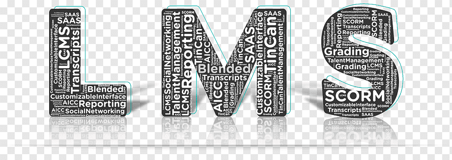
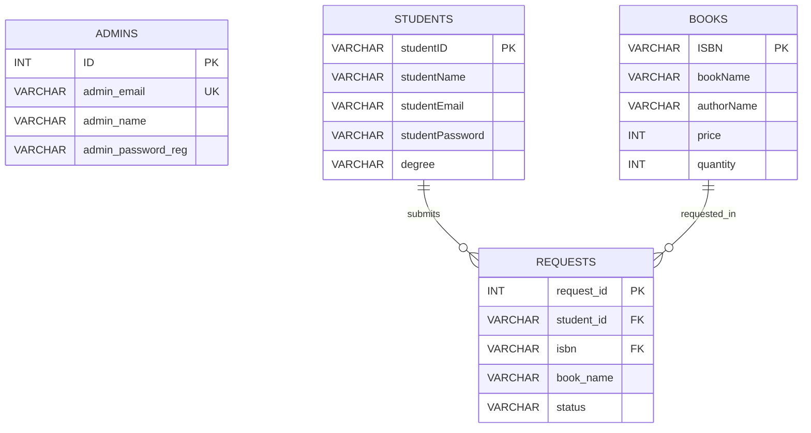

# Library Management System

A database-driven Library Management System developed as a university project using PHP, MySQL, HTML, CSS, JavaScript, and XAMPP.



## 📌 Project Overview

The system provides separate workflows for **administrators** and **students** to handle basic library operations.

It demonstrates PHP/MySQL authentication, session-based access, book management, student management, book searching, and book-request approval.

## ✨ Features

### Admin
- Admin registration and login
- Add books and students
- View, approve, and decline book requests
- Admin account details dashboard

### Student
- Student login
- Student profile dashboard
- Search books by title
- Submit book requests
- View submitted requests

## 🛠️ Technologies

- PHP
- MySQL
- HTML5
- CSS3
- JavaScript
- XAMPP / Apache
- phpMyAdmin

## 📂 Project Structure

```text
Library-Management-System/
│
├── admin/
│   ├── admin_service_dashboard.php
│   ├── addBook.php
│   ├── addStudent.php
│   └── requestsaction.php
│
├── student/
│   ├── student_dashboard.php
│   ├── searchBook.php
│   ├── requestBook.php
│   └── bookforrequest.php
│
├── auth/
│   ├── register.php
│   ├── loginadmin_server_page.php
│   ├── studentLogin_server_page.php
│   └── logout.php
│
├── includes/
│   ├── db.php
│   └── data_class.php
│
├── assets/
│   ├── css/
│   │   └── style.css
│   ├── js/
│   │   └── script.js
│   └── images/
│       ├── E1.jpg
│       ├── lib3.jpg
│       ├── lms.png
│       ├── lock.png
│       ├── person.png
│       ├── persons.jpg
│       └── unlock.png
│
├── database/
│   └── lms.sql
│
├── index.php
├── .gitignore
└── README.md
```

The project is now organized by responsibility: **admin pages**, **student pages**, **authentication handlers**, **shared PHP/database code**, and **frontend assets** are separated into their own directories.

## 🗄️ Database Design

The database contains four main tables: **admins**, **students**, **books**, and **requests**. Book requests connect students to books through foreign-key relationships.

GitHub can render the ERD directly from the Mermaid source:

[View the Database ERD](docs/ERD.md)



## ⚙️ Requirements

- XAMPP
- Modern web browser
- Git (optional)

## 🚀 Installation

### 1. Clone the repository

Place the project inside XAMPP's `htdocs` directory:

```bash
git clone https://github.com/Mtaha-az/Library-Management-System.git
```

For example:

```text
C:\xampp\htdocs\Library-Management-System
```

### 2. Start XAMPP

Start:

- Apache
- MySQL

### 3. Import the database

Open:

```text
http://localhost/phpmyadmin
```

Import:

```text
database/lms.sql
```

The SQL file creates the `lms` database and includes generic demo records.

> **Important:** The included SQL export resets the academic/demo tables when imported. Back up any local data you want to keep before importing it.

### 4. Run the project

Open:

```text
http://localhost/Library-Management-System/
```

## ☁️ Deployment

The repository includes a `Dockerfile` for container-based PHP/Apache deployment. The database connection supports both environments:

- **Local XAMPP:** falls back to `localhost`, MySQL user `root`, and database `lms`.
- **Railway:** reads `MYSQLHOST`, `MYSQLPORT`, `MYSQLUSER`, `MYSQLPASSWORD`, and `MYSQLDATABASE` from environment variables.

Database credentials are not hard-coded for the hosted environment. The schema in `database/lms.sql` must be imported into the hosted MySQL database when setting up a deployment.

## 🔑 Demo Accounts

**Admin**

```text
Email: demo@admin.library
Password: Demo123!
```

**Student**

```text
Student ID: demo001
Password: Demo123!
```

These credentials are for the included local/demo database only.

## 🔐 Security Improvements

The project has been cleaned up to use:

- `password_hash()` and `password_verify()` for passwords
- MySQLi prepared statements for database operations
- Basic server-side validation
- Escaped database output with `htmlspecialchars()`
- Session regeneration after successful login
- Role checks on protected admin/student pages
- UTF-8 / `utf8mb4` database connection

This is still an **academic project**, not a production application. A production deployment would additionally need stronger configuration/secrets management, CSRF protection across all state-changing forms, rate limiting, stricter authorization, logging, and more extensive testing.

## 🎨 UI Improvements

The interface has been refactored into a shared responsive stylesheet with:

- Consistent cards, forms, buttons, and alerts
- Responsive layouts for smaller screens
- Separate admin and student navigation
- Cleaner book and request cards
- Improved login/register layout
- Centralized colors and spacing using CSS variables

## 🎓 Project Purpose

This project demonstrates practical experience with:

- PHP server-side development
- MySQL database integration
- Authentication and session handling
- CRUD-style database operations
- Role-based workflows
- HTML, CSS, and JavaScript
- XAMPP-based local development

## 👨‍💻 Author

**Muhammad Taha Ahmad**  
BS Computer Science
