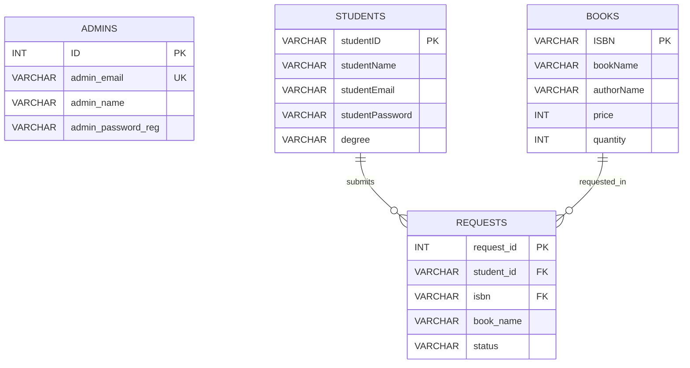

# Database ERD

This diagram documents the database structure used by the Library Management System.

## Relationships

- One **student** can submit zero or many book requests.
- One **book** can appear in zero or many requests.
- Each **request** belongs to exactly one student and one book.
- **Admins** manage the application workflow but are not directly referenced by the current request records.

The `requests.student_id` and `requests.isbn` columns are enforced as foreign keys in the database schema.
